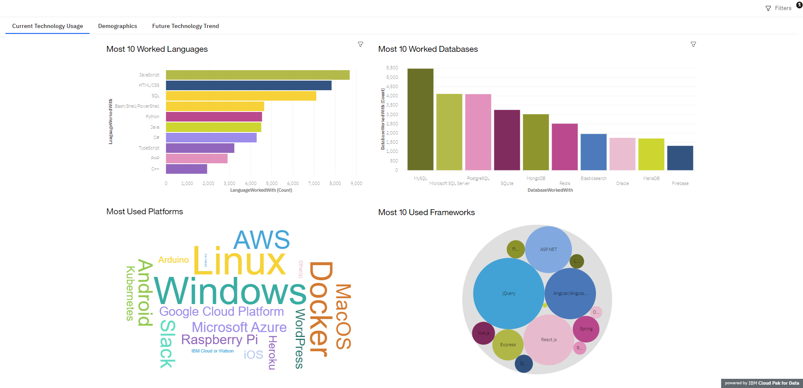
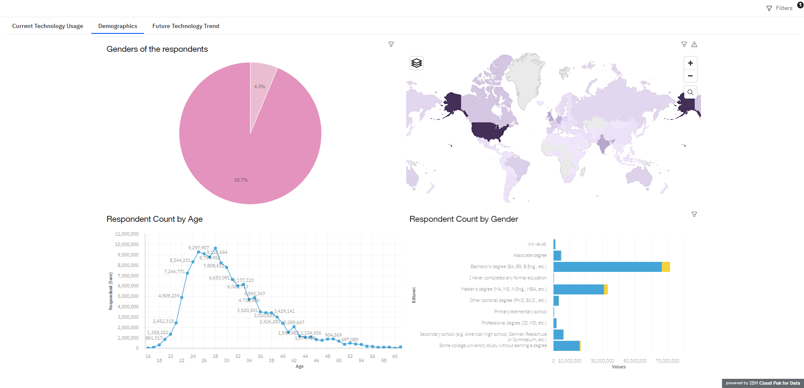
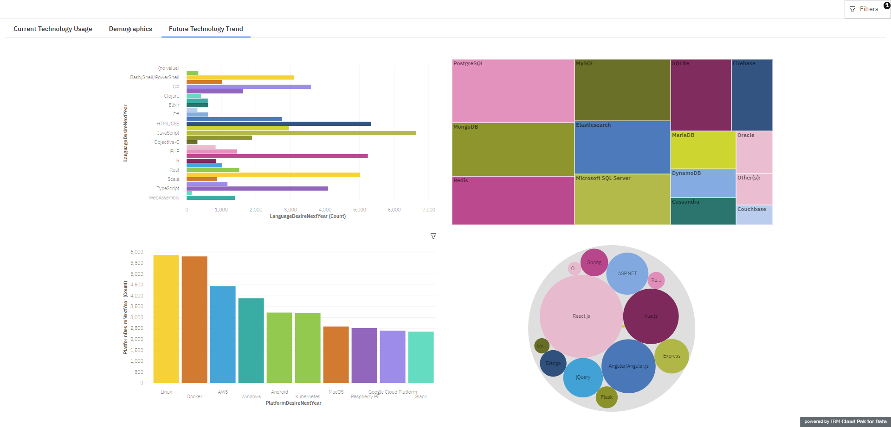

# Building a Dashboard with Cognos Dashboard Embedded

I developed this dashboard using the free lite plan version of Cognos Dashboard Embedded (CDE) on IBM Cloud.

---

## Dataset

The dataset used in this project is the [Stack Overflow Developer Survey](https://stackoverflow.blog/2019/04/09/the-2019-stack-overflow-developer-survey-results-are-in) from 2019, available under the ODbL (Open Database License).

## Overview

In this project, I worked with the Stack Overflow Developer Survey 2019 data to create a comprehensive dashboard. The dashboard includes the following sections:

### Current Technology Usage

- Top 10 Languages
- Top 10 Databases
- Platforms
- Top 10 Web Frameworks

### Future Technology Trends

- Top 10 Languages desired for the next year
- Top 10 Databases desired for the next year
- Desired platforms for the next year
- Top 10 Web Frameworks desired for the next year

### Demographics

- Respondent classification by gender
- Respondent count for countries
- Respondent count by age
- Respondent count by gender and classified by education level

## Screenshots

### Dashboard

#### [Dashboard Link](https://dataplatform.cloud.ibm.com/dashboards/5a650915-db43-4ef7-bd93-8c7bed5aea83/view/6735e12101a91bcf47e1c8e407ca7d037a612d5ababb8303d1827b495c312297f33d17c5c87b4d5cd2100062fbbf1508c0)

Feel free to check out the [dashboard link](https://dataplatform.cloud.ibm.com/dashboards/5a650915-db43-4ef7-bd93-8c7bed5aea83/view/6735e12101a91bcf47e1c8e407ca7d037a612d5ababb8303d1827b495c312297f33d17c5c87b4d5cd2100062fbbf1508c0) to explore the interactive features.

