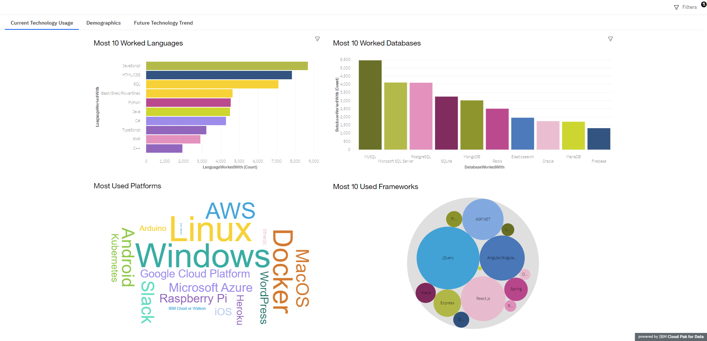
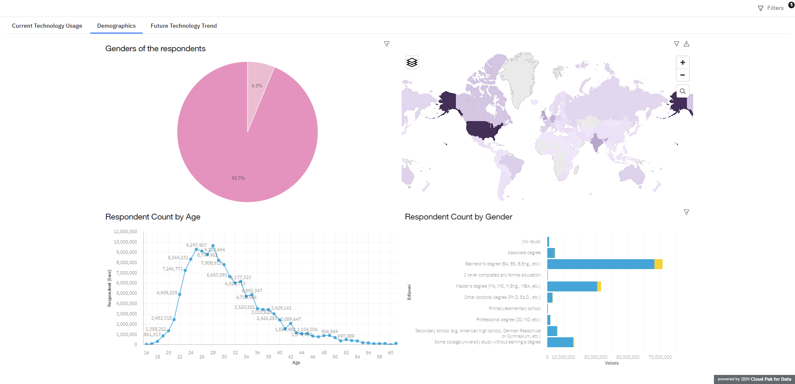

# Building a dashboard with Cognos Dashboard Embedded

 I used the free lite plan version of Cognos Dashboard Embedded (CDE) through IBM Cloud.

---

## Dataset

[StackOverFlow Developer Survey](https://stackoverflow.blog/2019/04/09/the-2019-stack-overflow-developer-survey-results-are-in)
under a ODbL: Open Database License.

##  Overwiev

In this project i continued working with the Stack Overflow Developer Survey 2019 data to create a dashboard. In this dashboard i created the following:

A Current Technology Usage tab containing:

- Top 10 Languages
- Top 10 Databases
- Platforms
- Top 10 WebFrames

A Future Technology Trends tab containing:

- Top 10 Languages desired for the next year
- Top 10 Databases desired for the next year
- Desired platforms for the next year
- Top 10 WebFrames desired for the next year

A Demographics tab containing:

- Respondent classified by gender
- Respondent count for countries
- Respondent count by age
- Respondent count by gender and classified by education level

## ScreenShots

### Dashboard

#### [Dashboard Link](https://dataplatform.cloud.ibm.com/dashboards/5a650915-db43-4ef7-bd93-8c7bed5aea83/view/6735e12101a91bcf47e1c8e407ca7d037a612d5ababb8303d1827b495c312297f33d17c5c87b4d5cd2100062fbbf1508c0)

